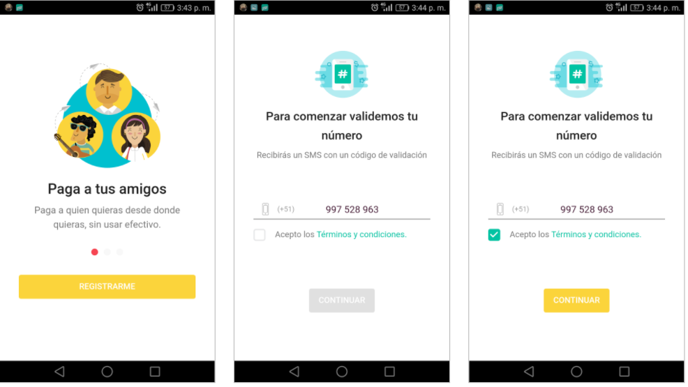

# Proyecto Final: Yape (Sprint 5)

Yape es la nueva aplicación del Banco de Crédito del Perú, con la que tendrás la libertad
de usar tu dinero como quieras, ya que pagar con ella es más rápido, sin pretextos y fácil.
Solo con Yape podrás convertir tus planes en experiencias únicas, si números de cuenta ni token.

### Reto

En este proyecto pondremos a prueba todo lo aprendido durante el Sprint 5, por ello tendremos los siguientes requerimientos:

- Trabajar con componentes
- Usar la data del API
- Seguir el diseño al 100%
- Estructura con buenas prácticas (HTML, CSS, JS)

### Trabajo por Hitos
 Cada hito propuesto a continuación se debe lograr avanzar cada día.

#### - Primer hito (martes 20/6):
        - Clonar el proyecto
        - Instalar con npm todas las dependencias
        - Correr el API
        - Estructurar el frontend del proyecto
        - Trabajar en las dos primeras pantallas
            Pantalla 1:
            Debe tener un carrousel de íconos y un botón de registro
            Pantalla 2:
            Debe poder ingresar un teléfono y poder aceptar los términos y condiciones
            El botón de continuar sólo se activa cuando un teléfono es ingresado y los términos aceptados
            Cuando se hace clic en continuar, el sistema debe enviar un request al API para registrar el teléfono y generar el código
            Tener en cuenta que el API no permite más de 2 registros del mismo teléfono a la vez

      Imagenes de las primeras pantallas:
       

#### - Segundo hito (miércoles 21/6):
        -Trabajar en las pantallas 3, 4 y 5
          Pantalla 3:
          Debe validar el código previamente generado en la pantalla anterior, el código es enviado mediante el API
          Al ingresar un código válido la pantalla, salta a la siguiente pantalla
          Debe haber un contador que a los 21 segundos llame al API para ingresar un nuevo código e invalidar el anterior
          Pantalla 4:
          Debe poder ingresar mis datos de usuario
          Sólo cuando todos mis datos están ingresados se debe activar el botón amarillo
          Debe tener validaciones básicas (email) y la contraseña no debe poderse ver
          Al hacer clic sobre el botón, debe enviar los datos al API y cuando regresa, debe pasar a la pantalla 5
          Pantalla 5:
          A los 3 segundos de mostrar esta pantalla, debe pasar a la siguiente
